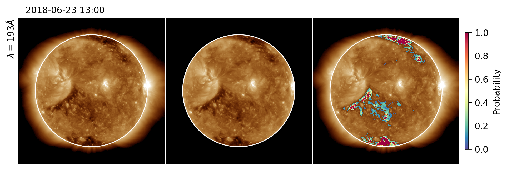

<!-- 
Author(s): Shibaji Chakraborty

Disclaimer:
pyCHIPS is under the MIT license found in the root directory LICENSE.md 
Everyone is permitted to copy and distribute verbatim copies of this license 
document.

This version of the MIT Public License incorporates the terms
and conditions of MIT General Public License.
-->

# Example Event: 13:00 UT, 23 June 2018
Before using this codebase please read the [installation](../user/install.md) details.

Explore the implementation of `pyCHIPS` through this illustrative Python code, which serves as a valuable resource for detecting Coronal Holes (CHs) and assessing their associated probabilities. The code provides a step-by-step demonstration of how to leverage `pyCHIPS` functionalities to identify CHs in solar imagery data. This hands-on example offers insights into the practical application of `pyCHIPS` for space weather research, enabling users to gain a deeper understanding of the CH detection process and the computation of associated probabilities. Whether you are a seasoned Python developer or new to space weather analysis, this code snippet offers a clear and insightful walkthrough, making it an excellent reference for those interested in utilizing `pyCHIPS` for CH detection and probability assessment in solar physics.

```
# Import nessesory generic python modules
import datetime as dt
import numpy as np

# Import nessesory pyCHIPS modules
from chips.fetch import RegisterAIA
from chips.plots import Annotation, ImagePalette
from chips.chips import Chips
```
Load a high-resolution 4K image from the Atmospheric Imaging Assembly (AIA) at the 19.3 nm wavelength into your analysis using the provided Python code. This code register, normalize and [preprocess](https://aiapy.readthedocs.io/en/latest/preparing_data.html) the disk image. Simply load the image, ensuring that the `apply_psf` parameter is set to `true` if you wish to invoke the Point Spread Function (PSF) specific to the AIA. It's crucial to note that enabling the PSF may lead to a substantial increase in time complexity due to the detailed computational processes involved. This code snippet serves as a valuable guide for researchers and developers seeking to integrate AIA imagery, offering flexibility in resolution and the option to apply the PSF for enhanced accuracy in their solar physics analyses. Whether you are an experienced user or new to AIA image processing, this code provides clear instructions for efficient implementation.

```
date = dt.datetime(2018, 6, 23, 13)
aia193 = RegisterAIA(
    date, [193], [4096], 
    apply_psf=False
)
```

> Load a high-resolution 4K image from local storage with `Regular Expression`. You can provide the regular expression of the filename (function of wavelength and date) or exact name as shown below, parameter `local_file`: 

```
date = dt.datetime(2018, 6, 23, 13)
aia193 = RegisterAIA(
    date, [193], [4096], 
    apply_psf=False,
    local_file="sunpy/data/aia_lev1_{wavelength}A_{date_str}*.fits",
)
```

Create a `Chips` object with the following python code and set a `medfilt_kernel` size. Make sure the size is odd. This median filter will be used to filter the regrsited/normalized image. Further it runs the main body of CHIPS algorithm.

```
chips193 = Chips(aia193, medfilt_kernel=11)
chips193.run_CHIPS()
```

> CHIPS offers a range of tunable parameters, providing users with the flexibility to customize their analysis based on specific requirements. The key parameters include:
>
> * `medfilt_kernel`: Controls the size of the median filter kernel.
> * `h_bins`: Defines the number of bins in the histogram for intensity data.
> * `h_thresh`: Specifies the intensity threshold for creating histograms.
> * `ht_peak_ratio`: Sets the ratio threshold for peak detection in histograms.
> * `hist_xsplit`: Determines the split position along the x-axis in histograms.
> * `hist_ysplit`: Determines the split position along the y-axis in histograms.
> * `threshold_range`: Defines the range for identifying threshold values.
> * `porb_threshold`: Sets the threshold for identifying potential coronal holes.
>
> Users have the flexibility to manually adjust these parameters to fine-tune the CHIPS algorithm for optimal results. For a detailed understanding of each parameter and its usage, users can refer to the [Documentation](../dev/chips.md). This comprehensive resource provides insights into the role of each parameter, offering guidance on parameter customization to generate the most accurate and meaningful outputs. Harnessing the power of these tunable parameters enhances the adaptability of CHIPS to various datasets and analysis scenarios, ensuring a versatile and user-centric experience.

Upon executing the `run_CHIPS` method, a series of informative summary plots will be automatically generated. Code will create a folder named `tmp/{YYYY.MM.DD}/` under the working directory that holds all the code outputs. To access detailed information about the identified coronal hole regions, users should refer to the `solar_ch_regions` object, which is a dictionary (`dict`) containing comprehensive insights. This object encapsulates key data points and characteristics of the detected coronal hole regions, ensuring that users have access to a clear and structured overview of the analysis results. By leveraging this object, researchers and analysts can streamline their post-processing activities, gaining valuable insights into the solar physics phenomena identified through the CHIPS algorithm. The integration of these summary plots and the user-friendly structure of the `solar_ch_regions` object enhances the efficiency and effectiveness of your coronal hole analysis workflow. Follwing summary figures will be generated by the `run_CHIPS()` method under `tmp/2018.06.23/` directory.

<figure markdown>

<figcaption>Figure 01: Final CHIPS output of 19.3 nm 4k '.fits' image at different stages.</figcaption>
</figure>

<figure markdown>

<figcaption>Figure 02: Different CH regions and associated probabilies for four different thresholds.</figcaption>
</figure>